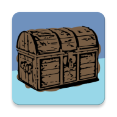
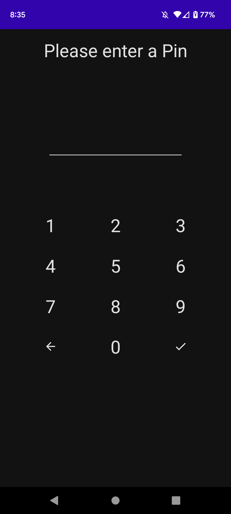
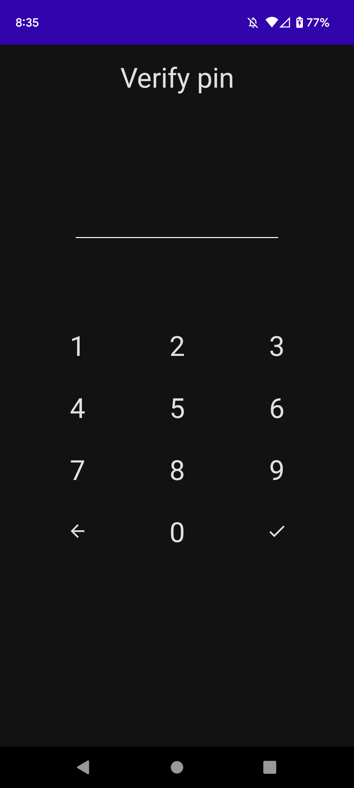
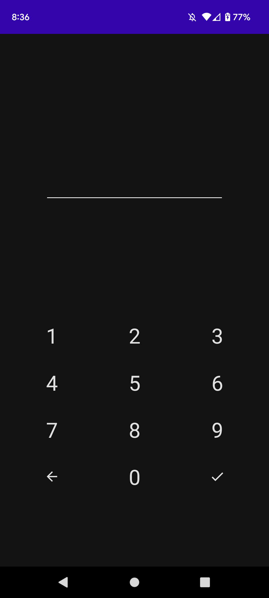
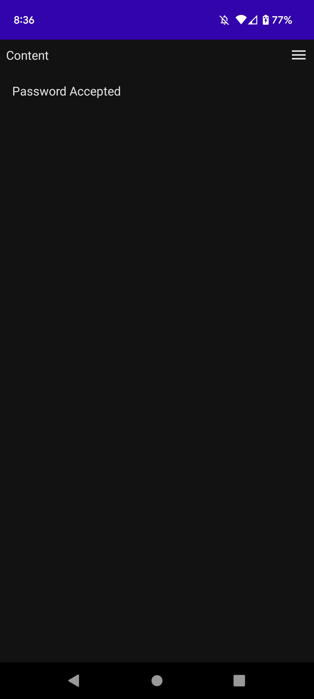

# Coffer

 

***Definition***: a strongbox or small chest for holding valuables

The Coffer app is a pin page app for setting a pin and then having app access behind it.

## About

I was thinking about an app where you could have access behind a pin page. I created this just as a way to have that, without actually implementing something to get to. There is nothing crazy here, a simple pin page, limited catching of edge cases, just a proof of concept.

## Screenshots

## Practice Technologies

- **Compose**
- **Compose Navigation**
- **Hilt** - Every different company has different DI, being familiar with some homegrown ones and then Dagger, but being that Hilt is currently Android's recommended way of achieving dependency injection, and it is now packaged alongside Android Jetpack....well, I needed to take a look
- **Preferences Datastore**

## Security

For password security we generate a random salt then hash and salt the password and store the salt and hash result. 

To reverse engineer this would require a person to get the salt, and then use that to generate all hashes to get the password, which is over the top and probably not gonna happen

## Future Considerations

- Make pin page more reusable
- Add ability to change pin after setup
- Intro screen
- Theming
- Back navigation after pin setup should exit app

....I think I got my worth out of working on this app, and it probably will not get any updates....